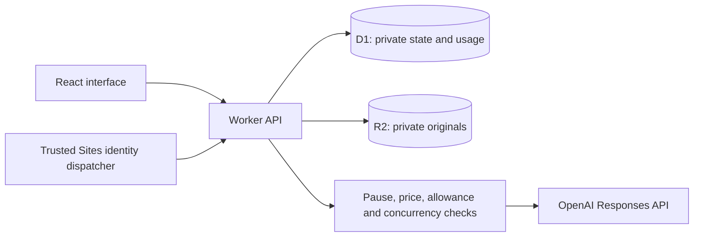

# Architecture and tradeoffs

Marquise is a small-group pilot, built with AI assistance and reviewed through automated checks and manual acceptance workflows. The frontend is French-first; repository documentation is English for code reviewers.

| Area | Location | Responsibility |
| --- | --- | --- |
| User interface | `app/marquise.tsx`, `components/` | Courses, exams, planning, cards, tutor, administration |
| Domain logic | `lib/study.ts` | Deterministic planning and recall scheduling |
| Extraction | `lib/extract.ts` | Browser PDF/PPTX text extraction with page/slide references |
| Generation | `lib/card-generation.ts`, `app/api/ai/route.ts` | Bounded batches, saved checkpoints, validated source references |
| Budget controls | `lib/ai.ts`, `app/api/admin/route.ts` | Atomic admission and owner configuration |
| Persistence/security | `lib/server.ts`, `app/api/` | Identity, membership, ownership, optimistic updates, file access |
| CSV | `lib/cards-csv.ts` | Parsing, duplicate checks and formula-safe export |

## Decisions

- Workers, D1 and R2 keep operations small. The app has no separate vector database or scheduled AI jobs.
- Per-user JSON state with revision checks is simple for a small pilot. The 1.5 MB structured-state limit makes it unsuitable for large libraries without normalization and pagination.
- Lexical retrieval bounds context and cost. It can miss synonyms or relevant passages; coverage counters do not mean every concept was covered.
- Browser extraction processes documents once; originals remain private. Diagrams and scanned pages require human review; no OCR/vision interpretation is implemented.
- Shared decks are copies. Sharing excludes original documents, tutor conversations and the sender's review history; imported copies cannot be revoked retroactively.
- PWA metadata supports installation where available. Private content is not cached offline.
- Vinext is a beta framework dependency. Keep the lockfile, verify upgrades, and treat migration to a more established runtime as a future engineering decision.

## Review and remaining work

The review found and addressed hidden loading errors, potentially mismatched model tariffs, and a test fixture generated into a missing directory on fresh clones. CI covers TypeScript, domain tests and the Worker build. API suites remain explicit local integration checks (see README).

The largest maintainability gap is the main React component. Extract course, flashcard, planning and administration screens incrementally with behavior checks, rather than combining a broad rewrite with feature changes. Other future work: physical iPad/Windows installation tests, automated browser regression coverage, dependency update review, retention policies and operator reconciliation of uncertain provider requests.

There is no claim of a penetration test, formal accessibility audit, optimal scheduling, guaranteed AI accuracy, or production scale certification.
